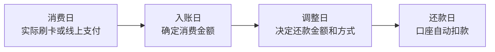

# 信用卡指北

刚到日本收入和信用记录仍在建立阶段的留学生，你有可能需要一张信用卡来让你的留学生活更加便捷。日本的信用卡和国内有一些区别，所以这篇文章可以帮助你更好的了解日本信用卡，并动手申请一张属于自己的信用卡。如果你打算申请信用卡，欢迎找群里菜狗要推荐码，主包也能喝杯斯达巴克斯٩(ˊᗜˋ*)و。

PS：本指南是主包自身经历总结，主包确确实实地用过每一张卡，如果你想了解的卡不在这里，也可以来私信问我或者问问GPT。写作可能有误，欢迎指正。

PPS：不保证任何信用卡一定审批通过。信用卡权益、年费、积分规则和申请条件会变更，正式申请前请以发卡公司官网为准。做成时间**2026年7月**。

## 前言

### 1. 信用卡是什么

信用卡是发卡公司先替你向商家付款，之后在每月固定日期从你的日本银行账户扣款的后付型支付工具。按照现在日元贬值的趋势，信用卡能够通过其晚还款一个月的特性省下不少钱。一般来说，日本信用卡最常见的支付方式包括：

- `1回払い`：次月一次性还款，不收手续费，优先使用。
- `2回払い`：分两次扣款，很多卡在日本国内使用时不收手续费，但并非所有商家支持。
- `分割払い`：指定 3 次以上分期，通常收手续费。
- `リボ払い`：每月还固定金额，余额越滚越久，手续费高。除非完全理解成本，否则不建议使用。开卡时一定注意不要勾选这个。
- `キャッシング`：信用卡取现，相当于借款，有利息且需要审查，不建议使用。

日本信用卡发卡公司很多，和国内不一样只由银行发行，所有取得资质的公司均可以发行自己的信用卡。但常见卡集中在少数大公司：三井住友カード、JCB、楽天カード、イオン、三菱UFJニコス、クレディセゾン、PayPayカード、エポスカード等。“发卡公司”和“卡组织”不是一回事。比如楽天カード可以发行 Visa、Mastercard、JCB、American Express 品牌卡；JCB 既是卡组织，也是发卡公司。日本信用记录很重要。逾期还款、频繁申请、短期解约、リボ/キャッシング乱用都会影响后续申请。

信用卡从消费到还款，大致会经历下面这条时间线：

- `消费日`：你实际刷卡付款，或在网上输入信用卡付款，得到信用卡公司批准的时间。
- `入账日`：商家向发卡公司提交交易后，消费金额正式入账。这个阶段可能会反映 `deposit`、`refund` 等金额变化，并累计进入下一月的还款账单中。一般在消费日后的一周内。
- `调整日`：账单确定后、还款日前，持卡人可以根据发卡公司的规则决定还款金额和还款方式，比如是否改成分割払い或リボ払い。一般是每月的月中。
- `还款日`：发卡公司从绑定的日本银行口座自动扣款。还款日前一定要确认口座余额足够。一般是每月月末工作日。口座自动扣款后1～3个工作日恢复额度，如果还款口座和信用卡是一家可以立刻恢复额度。

### 2. 卡组织

| 卡组织 | LOGO | 说明 |
|---|---|---|
| VISA （维萨） |  | 全球接受度最高的卡组织之一，一般只要接受信用卡一定有VISA。留学第一张主卡优先选 Visa 或 Mastercard。 |
| MasterCard （万事达） |  | 全球接受度和 Visa 接近，日本日常消费、网购、海外旅行都好用。Costco Japan 只接受 Mastercard。 |
| JCB （吉世美） |  | 日本本土卡组织，日本国内优惠和日系服务强。海外和部分海外网站接受度不如 Visa/Mastercard，适合作为第二张卡。 |
| American Express （美国运通） |  | 偏高端和旅行权益，保险、酒店、机场服务较多。年费门槛通常更高，小店接受度不如 Visa/Mastercard，在日本AMEX使用JCB渠道。 |
| Diners Club （大来国际） |  | 老牌高端卡组织，餐饮、旅行、机场休息室等权益突出。年费高、审查严，一般不作为第一张卡。申请Diners会送一张Master Card副卡（你也知道没地方用啊）。 |
| Union Pay （银联） |  | 日本发行的中国银联卡路边一条，过来凑数的。 |

### 3. 准备清单

申请前请先准备好：

- 在留カード。（新版本在留卡功能还不完善，尽量不要更换新版）
- My Number Card（非必须，可以加快下卡）。
- 日本手机号。很多发卡公司会用短信/电话确认（例如主包收到乐天打来的电话确认出生日期和星座，我还让人家等一下我去查个单词）。
- 日本银行账户。用于每月口座振替扣款。来日不满半年可以办理邮局银行。
- 学生证以及学校信息。学生专用卡会用到。
- 姓名写法要统一。一般建议中日汉字无异体字时优先使用汉字，否则使用拼音字母。使用汉字名时罗马音一定要写成护照上的字母。姓名不一致是最多的拒卡理由。

## 信用卡推荐：免年费普卡（同一发卡公司共享额度）

### 楽天カード株式会社

乐天信用卡是日本最受欢迎、发行量最大的信用卡之一。如果你的生活以乐天经济圈为主，首选乐天旗下的信用卡。乐天旗下有手机卡，宽带，银行，投资证券，购物，支付软件等多方面产品。多业务叠叠乐能叠出很高的返现率。

#### 楽天カード

官网：[楽天カード](https://www.rakuten-card.co.jp/)

卡面：

| 标准卡面 | My Color Selection | 進撃の巨人 デザイン | キキ＆ララ デザイン |
|---|---|---|---|
|  |  |  |  |

开卡奖励：3000～11000积分不等，**有人推荐时推荐人可获得9000积分，开卡人获得11000积分。建议有活动时找人推荐。**

基础：

- 最高额度100万。但是，申请身份为学生则最高为30万，首次下卡额度一定为10万。
- 首次下卡额度一般是10万/20万/30万这三种。
- **消费通常 100 円 = 1 楽天ポイント，基础返还率约 1.0%**。
- Visa、Mastercard、JCB、American Express 可选。

优点：

- 最友好的地方是“积分好用”：便利店、药妆、网购、手机费都能消化楽天ポイント，能累积和使用楽天ポイント的地方非常多。
- 平时会有活动，特定店铺高反点，或者消费抽奖等。
- 卡面比乐天学生卡丰富。

缺点：

- 活动获得的有可能期间限定ポイント、活动入口较复杂。
- 审查随缘，不是人人都能过。
- **使用后不是立刻邮件通知，App也没有通知，一般是次日才通知。**

#### 楽天カード アカデミー

官网：[楽天カード アカデミー](https://www.rakuten-card.co.jp/card/rakuten-card-academy/)

卡面：

开卡奖励：同样3000～11000积分不等，**有人推荐时推荐人可获得9000积分，开卡人获得11000积分。建议有活动时找人推荐。**

基础：

- 学生限定，最高额度 30 万。首次下卡额度一定是10万。
- **消费通常 100 円 = 1 楽天ポイント，基础返还率约 1.0%**。
- 卡组织只能选择VISA或者JCB。
- 18 岁以上 28 岁以下学生可申请。
- 毕业后自动切换为楽天カード。

优点：

- 比普通卡更符合学生身份，额度上限较克制，适合第一张卡。
- 好下卡。

缺点：

- 家族卡不可附带。
- 卡组织选择较普通楽天カード少。
- 额度上限较低，大额购物可能不够。
- **使用后不是立刻邮件通知，一般是次日通知。**

### 三井住友カード株式会社

三井住友信用卡是日本首屈一指的信用卡发卡机构，隶属于日本三大金融巨头之一的三井住友金融集团。三井也有自己的经济圈，Vポイント和楽天ポイント覆盖率几乎一样。在全日本的7-Eleven、罗森、麦当劳、萨利亚等指定便利店和连锁餐厅消费时，只要使用手机（Apple Pay / Google Pay）进行 Visa/Mastercard 触碰支付（Touch 決済），即可享受高达 **7%** 的 Vポイント 回馈。**算是最难下卡的几个发卡公司了。**

#### 三井住友カード（NL）（如果有Olive口座，Olive优先）

官网：[三井住友カード（NL）](https://www.smbc-card.com/camp/numberless/index.jsp)

卡面：

| グリーン | オーロラ | シルバー |
|---|---|---|
|  |  |  |

开卡奖励：1000～3000，几乎无介绍奖励。

基础：

- **年会费永年免费**。
- 可选Visa/Mastercard。
- **普通消费基础返还率 0.5%**，对象便利店/饮食店使用指定タッチ決済可享较高 Vポイント还元。

优点：

- 便利店、麦当劳、萨利亚等日常消费强。
- 安全性、App、利用通知体验较好。

缺点：

- **普通消费只有0.5%，基础返点不算高。**
- **下卡额度低，一般只有10万且难提额。**
- **无卡号卡部分店家会不让你使用，海外尤其多见。**
- 高返点需要同时满足“对象店 + 指定支付方式”等条件，iD/QuickPay/实体卡不享受同样倍率。
- 银行系卡审查可能更看重稳定收入和在留信息。

#### Amazon Mastercard

官网：[Amazon Mastercard](https://www.smbc-card.com/nyukai/affiliate/amazon/index.jsp)

卡面：

| Amazon Mastercard | Amazon Prime Mastercard |
|---|---|
|  |  |

开卡奖励：4000～9000，**活动期间有人介绍时介绍人可以获得2000～4000的积分奖励，开卡人获得7000～9000的奖励。**

基础：

- **年会费永年免费，ETC 年会费也永年免费**。
- **Amazon.co.jp 消费返还率：Prime 会員 2.0%，非 Prime 会員 1.5%**。
- **Amazon.co.jp 以外基础返还率 1.0%**，セブン‐イレブン、ファミリーマート、ローソン为 **1.5%**。
- 7-11（无罗森和全家）使用 Apple Pay 的 Mastercard タッチ決済可最高 7% Amazonポイント还元。

优点：

- Amazonポイント直接进 Amazon 账户，1 点约等于 1 円，消化难度低。
- Mastercard 接受度高，作为日常备用卡也够用。
- ETC 年会费免费，对自驾、租车、旅行有用。

缺点：

- 积分是 Amazonポイント，不是 Vポイント；离开 Amazon 是废卡。
- 只有 Mastercard，不能选择 Visa/JCB/AMEX。
- 不常用 Amazon 的话没啥用。
- 7-11最高 7% **只能使用苹果手机 Apple Pay**  タッチ決済，安卓手机 Google Pay 不适用最高倍率。

### 株式会社ジェーシービー

JCB 是日本本土信用卡公司，1961 年设立，总部在东京。它比较特殊：既是发卡公司，也是国际卡组织，所以你会看到JCB发行的JCBカード和其他公司发行的 JCB ブランド卡。JCB 的优势在日本国内、日系服务、JCB ORIGINAL SERIES 优待店和安全服务；短板是海外和部分海外网站的接受度不如 Visa/Mastercard。

#### JCB カード W

官网：[JCB カード W](https://www.jcb.co.jp/ordercard/kojin_card/os_card_w.html)

卡面：

| JCB カード W | JCB カード W plus L |
|---|---|
|  |  |

开卡奖励：**直接奖励几乎没有**，通过消费可以获得最高24000日元的返点。**推荐人推荐有2000～5000的有条件返利。**

基础：

- 只有JCB可选。
- 18-39 岁入会限定。只能 WEB 申请。
- JCB カード W plus L 与 JCB カード W 基本服务相同，女生有额外特典。
- **基础返还率约 1.0%**。麦当劳，吉野家，星巴克 **10.5%返点**。7-11，Amazon，Uber Eats **2%返点**。

优点：

- 日本国内、Amazon、星巴克、JCB 优待店等场景好用。高返点不必须使用Apple Pay。
- J-POINT 至少比以前的 Oki Doki 积分好用了一些。
- 有不显示卡号的ナンバーレス版本，比较漂亮。**无卡号卡部分店家会不让你使用，海外尤其多见。**MyJCB App 可查看卡号。

缺点：

- 海外和部分海外网站接受度不如 Visa/Mastercard。
- 开卡奖励烂。J-POINT使用范围有限。

### PayPayカード株式会社

PayPayカード株式会社是 Yahoo JAPAN 体系里的信用卡发行公司，强项是 PayPay、Yahoo!ショッピング、LOHACO、SoftBank/Y!mobile 生态。适合日常高频使用 PayPay 的人。

#### PayPayカード

官网：[PayPayカード](https://www.paypay-card.co.jp/)

卡面：

| ブラック | ラベンダー | ブルー | ピンク |
|---|---|---|---|
|  |  |  |  |

开卡奖励：2000～5000，推荐人和开卡人可以同时额外各获得500。

基础：

- **年会费永年免费**，家族卡也免费，但是家族卡一般需要同姓氏。
- **基础返还率 1.0%**，PayPayポイント按 **200 円（税込）ごと**计算。
- PayPayクレジット/PayPay App 联动强，PayPay ステップ达成后可上调。
- Visa / Mastercard / JCB 可选。
- ETC 卡普通卡为每张 **550 円/年**。

优点：

- **最容易下卡，会呼吸就能下。**
- 如果你常用 PayPay、Yahoo!ショッピング、LOHACO，很容易消化积分。
- **PayPayポイント可按 1 点 = 1 円相当**在 PayPay 支付中使用。
- 手机支付体验好，便利店、外卖、线下小额消费方便。
- Yahoo!ショッピング/LOHACO 里叠活动时返还率比普通 1% 高。

缺点：

- **PayPayポイント不能出金/转让**，使用范围受生态限制。
- **ETC 卡不是免费**，开车用户要注意。
- **初始开卡额度低，最低只有3万。**
- 高返还多数依赖 PayPay/Yahoo 生态，不用 PayPay 的话优势明显下降。

### 株式会社イオン銀行 / イオンフィナンシャルサービス

AEON 系信用卡适合住处附近有大型AEON永旺超市、まいばすけっと（My Basket）、MaxValu、Welcia药妆店等生活圈的人。

#### イオンカード / イオンカードセレクト

官网：[イオンカード一覧](https://www.aeonbank.co.jp/aeoncard/cards/)

卡面：

| イオンカード（WAON一体型） | イオンカードセレクト（通常デザイン） |
|---|---|
|  |  |

开卡奖励：5000，推荐人可以获得1000。

基础：

- JCB/VISA可选。
- **基础返还率约 0.5%**：通常 **200 円 = 1 WAON POINT**。
- AEON 集团对象店通常 **200 円（税込）= 2 WAON POINT，约 1.0%**。
- 每月 **20日/30日感谢日**  AEON 店内有打折活动。
- イオンカードセレクト和三井住友Olive一样带 **口座 + 信用卡 + WAON积分卡** 一体功能。

优点：

- 住处附近有 AEON 系超市时非常实用。
- WAON POINT 在 AEON 生活圈内好消化。
- 年间消费达50万条件后可以升级 **年会费免费的金卡**。

缺点：

- AEON 以外的优势弱于楽天/三井/PayPay生态。
- イオンカードセレクト需要 先办理**イオン銀行口座**。
- 通常消费 **0.5%** 返点不算高，离开 AEON 后算废卡。

### 株式会社エポスカード

エポスカード是丸井集团旗下发卡公司，普卡长期免年费且附带海外旅行保险。有些房子的保险会让你用这张卡缴纳，所以会帮你开一张信用卡，你不需要自己费力申请还被拒绝。 此外EPOS经常会在商场出展搞活动办卡。以及众所周知的傻逼二刺猿卡面非常多，消费一定金额送谷子（主包狂喜）。

#### エポスカード Visa

官网：[エポスカード](https://www.eposcard.co.jp/index.html)

卡面：这是真牛b

| エポスカードVisa |
|---|
|  |

联名卡面（部分）：

| 魔法少女まどか☆マギカ | 彼女、お借りします | 僕の心のヤバイやつ | Summer Pockets |
|---|---|---|---|
|  | 千鹤是好女孩 |  |  |

| ガールズバンドクライ | 転生したらスライムだった件 | 東方Project | ずっと真夜中でいいのに。 |
|---|---|---|---|
|  |  |  |  |

| EVANGELION | FUN'S PROJECT | コーエーテクモゲームス | ちいかわ |
|---|---|---|---|
|  |  |  |  |

| 夏目友人帳 | すみっコぐらし | ゆるキャン△ | ONE PIECE |
|---|---|---|---|
|  |  |  |  |

| Fate/stay night | 新テニスの王子様 | 銀魂 |
|---|---|---|
|  |  |  |

开卡奖励：2000，无介绍奖励。

基础：

- **基础返还率约 0.5%**：通常 **200 円（税込）= 1 エポスポイント**。
- **Visa 单品牌**。
- **ETC 年会费免费**，海外旅行伤害保险为利用付帯。
- Marui 店铺可支持较快发卡/取卡。

优点：

- 骏河屋和らしんばん有优惠券。
- 海外旅行保险对回国、旅游有用，但需要按条件用卡支付旅行代金。
- 通过邀请或年 50 万円消费可换金卡。
- **卡面不满意了？1000日元就可以随便换卡面！！！重新刷卡就可以继续领取卡面对应的谷子**

缺点：

- **基础返点0.5%低。**
- Marui/优待店以外吸引力下降。
- 保险不是自动付带，有付帯条件。

### 株式会社クレディセゾン

クレディセゾン是日本老牌信贩/信用卡公司，特点是数字发卡、永久不滅ポイント、AMEX 联名卡和多种商户合作。SAISON CARD Digital 适合想尽快拿到卡号、又不想管理积分有效期的人。

#### SAISON CARD Digital

官网：[SAISON CARD Digital](https://www.saisoncard.co.jp/creditcard/lineup/082/)

卡面：

开卡奖励：3000～8000（有消费条件），介绍人1000～2000。

基础：

- **年会费免费**。
- **基础返还率通常约 0.5%相当**：永久不滅ポイント **1000 円（税込）= 1 ポイント**，兑换价值随用途变化。
- 最短 **5 分钟**数字发卡，实体卡为完全ナンバーレス。
- Visa / Mastercard / JCB / American Express 可选。
- 积分原则上没有通常有效期。

优点：

- 数字发卡快，下卡容易，额度宽松。
- **永久不滅ポイント**适合消费不高的人，重点是**永久有效**，一般的积分是有有效期的。
- セゾン优待、App 体验很好，有即时消费App弹窗。
- 能用セゾン系部分优待，如セゾンの木曜日（电影票优惠）。
- 可选 AMEX，想体验 AMEX 但不想付年费的人可以考虑，但其实我推荐下面的金卡。

缺点：

- **基础返还不如 1% 卡直观**，1000 円以下零散消费体感一般。
- 如果不用セゾン体系，积分兑换需要学习。
- 高端权益需要升级到 AMEX 系卡。

#### DMM JCBカード

官网：[DMM JCBカード](https://card.dmm.com/)

卡面：

| Pure White | Matte Black | 雀魂 |
|---|---|---|
|  |  |  |

开卡奖励：8000~10000（部分时候有当月1万消费要求），无推荐人返点。

基础：

- JCB 单品牌
- **入会金、年会费免费**，但入会月到翌年同月完全没有用卡时，会收 **カードサービス手数料 1650 円（税込）**。
- **DMM/FANZA 站内服务使用返还率 3.0%**，适合买二刺猿谷子，一番赏，旮旯给木。
- **DMM/FANZA 站外普通消费返还率 1.0%**，积分为 DMMポイント。

优点：

- **DMM 站内 3% **，DMM ブックス、DMM TV、DMM GAMES 等高频用户容易回本。
- 站外普通消费也有 **1%**，比多数 0.5% 要好。
- 最短 5 分钟可在セゾンPortal里确认卡号，DMM アカウント可自动登录后较快使用。
- 能用セゾン系部分优待，如セゾンの木曜日（电影票优惠）。
- 卡面选择多，黑白基础款和 DMM GAMES 合作款都比较有辨识度。

缺点：

- **积分是 DMMポイント**，离开 DMM 生态后使用价值明显下降。
- JCB 单品牌，海外和部分海外网站接受度不如 Visa/Mastercard。
- “年会费免费”有未使用手续费条件，**长期闲置不刷会被收 1650 円**。
- DMM/FANZA 站内 3% 有对象外服务，不是所有 DMM 支付都吃满。

#### セゾンゴールド・アメリカン・エキスプレス・カード（年会费优遇型）

官网：[セゾンゴールド・アメリカン・エキスプレス・カード](https://www.saisoncard.co.jp/amextop/gold-pro-14az/)

卡面：

开卡奖励：2000～8000，介绍人可以获得2000的亚马逊礼品卡。

基础：

- American Express 单品牌。
- **初年度年会费免费**，通常年会费为 **11000 円（税込）**。
- **但是每年 1 回（1 円）以上使用，次年年会费免费**；手机费、公共料金等持续扣款也可计入。
- **基础返还率约 0.75%相当**：永久不滅ポイント通常 **1000 円（税込）= 1 ポイント**，本卡国内购物为 **1.5 倍**。
- 海外购物为永久不滅ポイント **2 倍**，按 1 ポイント = 5 円相当时约 **1.0%相当**。

优点：

- 首年免年费，**刷一笔就能维持实质年会费免费**，拿金卡权益的成本很低。
- 国内主要机场和夏威夷 Daniel K. Inouye 国际机场休息室可用，每年可以使用 2 回。
- 从国外返回日本时，在机场可以将行李免费寄回家，每年 2 次。
- 海外/国内旅行自带伤害保险最高 **5000 万円**。
- **星野リゾート旗下酒店有额外最高6折优惠**（这个还是很有用的）。
- 能用セゾン系部分优待，如セゾンの木曜日（电影票优惠）。
- 永久不滅ポイント永久有效，适合不想频繁管理积分的人。

缺点：

- **不是无条件永年免费**；如果一年完全不用，次年会收通常年会费。
- 年会费优遇型和有料普通セゾンゴールドAMEX有差异，**不能加入セゾンマイルクラブ**，国内机场休息室也有次数限制。
- 毕竟是金卡，审核有一定门槛，不建议上来直接申请金卡。

### 三菱UFJニコス株式会社

三菱UFJニコス是 MUFG（三菱UFJフィナンシャル・グループ）旗下的大型发卡公司，传统银行系属性很强。三菱UFJカード适合想要大银行系信用卡、又会在便利店/超市/饮食对象店消费的人。**权益上基本上和三井住友信用卡重合了，这两家二选一就行。**

#### 三菱UFJカード

官网：[三菱UFJカード](https://www.cr.mufg.jp/apply/card/mucard/index.html)

卡面：

| Mastercard | Visa | American Express |
|---|---|---|
|  |  |  |

VIASOキャラクターカード（同为三菱UFJニコス发行，和三菱UFJカード本体不同）：

| スヌーピー | シナモロール | クロミ |
|---|---|---|
|  |  |  |
| マイメロディ（Mastercard） | マイメロディ（Visa） | ぐでたま |
|  |  |  |
| mofusand×サンリオ | アズールレーン | ぼっち・ざ・ろっく！ |
|  |  |  |
| けいおん！（キャラクター） | けいおん！（楽器） | ラブライブ！ |
|  |  |  |

开卡奖励：2000～30000（有条件）。

基础：

- Visa / Mastercard / JCB / American Express 可选。
- **年会费永年免费**。
- **1 个月购物合计 1000 円 = 1 グローバルポイント**。
- 以 **1 ポイント = 5 円相当**商品兑换时，**基础返还率约 0.5%**；现金返还时价值可能不同。
- 对象便利店、饮食店、超市等可 **最大 20%ポイント還元**。

优点：

- 想不出来。

缺点：

- **基础返还约 0.5%**，不看对象店时并不突出。
- **最大 20%** 条件复杂，且有对象店和上限限制。
- 不必三井容易下卡。

### 株式会社NTTドコモ・フィナンシャルグループ

dカード是 docomo/d払い/dポイント经济圈的基础信用卡。即使不是 docomo 手机用户也可以用，但如果你用 ahamo、docomo、d払い、ローソン、マツキヨココカラ，会更划算。

#### dカード

官网：[dカード](https://dcard.docomo.ne.jp/st/dcard_dcard/index.html)

卡面：

| ホワイト | レッド | ブルー |
|---|---|---|
|  |  |  |

开卡奖励：1000，介绍人1000。

基础：

- Visa / Mastercard 可选。
- **年会费永年免费**。
- **100 円（税込）= 1 dポイント，基础返还率 1.0%**。
- iD 搭载，docomo/d払い/dポイント生态联动。
- dカード服务已于 2026-07-01 承继给 NTTドコモ・フィナンシャルグループ。

优点：

- docomo、ahamo、d払い、ローソン、マツキヨ等场景好用。
- iD 小额支付方便，便利店体验好。

缺点：

- 基本上是 docomo 运营商用户用。
- dポイント活动规则较多。

### auフィナンシャルサービス株式会社

au PAY カード是 KDDI/au/UQ/Ponta 体系的基础信用卡。和dカード一样，几乎是契约了运营商才会用。它本身是一张 **1% Ponta 卡**，如果你用 au、UQ mobile、au PAY、au PAY マーケット，能更好消化积分。其它的话就很烂了。

#### au PAY カード

官网：[au PAY カード](https://www.kddi-fs.com/)

卡面：

开卡奖励： 3000 Pontaポイント。

基础：

- **年会费永年免费**。
- **100 円（税込）= 1 Pontaポイント，基础返还率 1.0%**。
- Visa / Mastercard / American Express 可选。
- 需要个人 au ID；au/UQ 用户更适合。

优点：

- Ponta 在罗森、药妆、餐饮、电商中使用范围较广。
- au PAY 残高、au PAY マーケット、au/UQ 账单联动好。
- **1% 基础返还 + Ponta 易用**，适合作为 Ponta 系备用卡。

缺点：

- 最大价值偏向 au/UQ 用户。

### ライフカード株式会社

ライフカード是学生卡领域很常见的发卡公司，对牢日去海外留学的话比较划算，海外消费4%返点。如果你经常回国、旅行、短期出国，它可能有点用。但是！**日本的信用卡境外消费很不划算**，一方面汇率吃亏，另一方面信用卡要收取**海外事務処理手数料**，这玩意从**2% 到 5% **不等。所以这玩意的意义也是傻逼二刺猿收集卡面。

#### ライフカード

官网：[学生専用ライフカード](https://www.lifecard.co.jp/card/credit/std/)

卡面：

| ホワイト | ブラック | Barbie |
|---|---|---|
|  |  |  |

| ソードアート・オンライン（縦） | ソードアート・オンライン（横） | ガンゲイル・オンライン |
|---|---|---|
|  |  |  |
| リコリス・リコイル | UniteUp! | 負けヒロインが多すぎる！ |
|  |  |  |
| アーリャさん（縦） | アーリャさん（横） | よう実 |
|  |  |  |

开卡奖励：最高 15000 円キャッシュバック（有条件），条件以申请页为准。

基础：

- 免年费。
- Visa/Mastercard/JCB 可选。
- 学生卡限制 **18-25 岁**，有卡面的普卡不限制。
- **基础返还率约 0.5%相当**，按 LIFE サンクスポイント体系兑换。
- **海外ショッピング利用总额 4% キャッシュバック**，年間最大 **100000 円**，需要提前申请参加活动（エントリー）。

优点：

- **海外 4% キャッシュバック**（你真的要在海外用日卡吗？）。
- 卡面好看。

缺点：

- 学生特典随毕业结束。
- **基础返还不强**，日本国内日常刷卡不如 1% 普卡。

### 航空系学生卡

航空系学生卡不适合日常主卡，比较适合经常回国、旅行、修士/博士期间学会出差的人。它们的返点不是point，是各航司的里程mile；マイル价值取决于你怎么换机票，用得好会高于 1 円/マイル，最高能做到1 円/ 10マイル。用不好就很容易砸手里，因为里程是有有效期的。

#### JALカード navi（都说是神卡，但是我没办过，因为不坐寰宇一家）

官网：[JALカード navi](https://www.jal.co.jp/jp/ja/jalcard/card/navi.html)

卡面：

开卡奖励：学生限定入会活动不定期变化，最大 **3000 マイル** ，以申请页为准。

基础：

- 学生专用，**在学期间年会费免费**。
- **ショッピング 100 円 = 1 マイル**；按 1 マイル约等于 1 円时，**基础返还率约 1.0%相当**。特約店可 **100 円 = 2 マイル**。
- 在学期间マイル有效期可享特殊扱い，这时候可以慢慢攒。
- Visa / Mastercard / JCB 可选。
- 适合经常搭日航或国泰的。

优点：

- **100 円 = 1 マイル** 对学生航空卡来说很牛了。
- 在学期间年费免费，マイル相关权益集中。
- 回国、旅行、实习出差较多的人能积累里程。
- JAL/oneworld 路线用得上时，マイル价值可能高于普通积分。

缺点：

- 不飞 JAL/oneworld 时价值明显下降。
- 里程规则比普通积分复杂，有有效期和兑换限制。
- 学生身份结束后会貌似会自动销卡？

#### ANA学生カード（我也没办过，有上位替代）

官网：[ANA学生カード](https://www.ana.co.jp/ja/jp/amc/anacard/st_card/)

卡面：

| Visa / Mastercard | JCB |
|---|---|
|  |  |

开卡奖励：在学中 **每年 送 1000 マイル** 。以申请页为准。

基础：

- **在学中年会费免费**。
- Visa / Mastercard / JCB 可选。
- 日常购物通常 **100 円につき 0.5 マイル相当**；按 1 マイル约等于 1 円时，**基础返还率约 0.5%相当**。
- ANAカードマイルプラス加盟店可另加 **100 円或 200 円（税込）= 1 マイル**。
- 25 岁以下运费等 ANA 学生向け权益较多。
- 适合经常搭 ANA或者其他星空联盟航司的航班。

优点：

- ANA 里程、搭乘 bonus 对回国航线有价值。
- **每年 1000 マイル + 在学中年费免费**，持有成本低。

缺点：

- 不坐 ANA/Star Alliance 时收益有限。
- 里程兑换需要提前规划，有时候里程票抢不到。
- 航空卡不建议替代第一张泛用生活卡。
- ANA マイル通常有有效期，攒太慢可能浪费。

## 不免年费信用卡

富哥富姐专属。如果你觉得现在的卡不能满足自己的需求，例如额度不够，羊毛没薅够，就可以考虑不免年费的信用卡了。看不免年费卡时建议先问自己三件事：

- **年费能否稳定回本**：很多金卡要年消费 50 万、100 万、200 万円才明显划算。
- **是否有本人稳定收入**：不少金卡、白金卡要求本人有稳定收入，学生身份不一定容易通过。
- **权益是否真的会用**：机场 Lounge、酒店高卡、礼宾、保险不用就等于没有。

我把乐天，JCB学生身份不能申请的卡都排除掉了。

### 三井住友カード株式会社

三井住友的金卡依旧是 Vポイント、対象コンビニ/飲食店高返点、SBI 证券相关权益。

#### 三井住友カード ゴールド（NL）（如果有Olive口座，Olive优先）

官网：[三井住友カード ゴールド（NL）](https://www.smbc-card.com/nyukai/card/gold-numberless.jsp)

卡面：

开卡奖励：几乎是没有。

基础：

- 年会费通常 **5500 円（税込）**。
- **通常消费 200 円（税込）= 1 Vポイント，基础返还率约 0.5%**。
- 年间 100 万円利用达成后，翌年以后年会费永年免费；但初年度年会费仍通常发生。
- **偶尔会有限时申请免首年年费，最好是在活动期间申请，**大不了用完一年切换到普卡。
- 每年 100 万円利用达成可获得 **10000 Vポイント**，相当于在 100 万消费上额外约 1.0%。
- 対象コンビニ/飲食店手机 touch 支付可享高还元，机制与三井住友普卡相近。

优点：

- 能稳定年刷 100 万円的人能拿到最高1.5%的返还率，达标后长期持有成本低。
- 年费永年免费达成后，作为长期主力卡很舒服。
- Vポイント覆盖率高，在日本日常消费里比较好消化。

缺点：

- 年 100 万円不包括所有交易类型，需看官方对象条件。
- 审查难，未必容易通过。

### PayPayカード株式会社

PayPayカード的付费卡主要服务 PayPay、Yahoo!、SoftBank/Y!mobile 生态。2026 年 6 月以后，PayPayカード ゴールド的特典有调整。

#### PayPayカード ゴールド （现在是大聪明卡，不建议申请了）

官网：[PayPayカード ゴールド](https://www.paypay-card.co.jp/service/card/fee/)、[年間利用特典](https://www.paypay-card.co.jp/service/benefit/gold-point/)

卡面：

开卡奖励：2026 年 6 月以后首次入会者，新规入会 **5000 PayPayポイント**，再达成年间 100 万円利用可追加 **6000 PayPayポイント**，合计最大 11000 ポイント。2 年目以后为年 100 万円利用达成后 11000 ポイント。

基础：

- 年会费 **11000 円（税込）**。
- **基本付与率 1.0%**，条件达成特典可追加 0.5%，合计最大 **1.5%**；付与按 200 円（税込）单位计算。
- 年间 100 万円以上利用可获得 **11000 PayPayポイント** 年间利用特典。
- LYPプレミアム、机场 lounge、ETC 年会费免费等。
- PayPayポイント不可出金、不可转让。

优点：

- PayPay/Yahoo!/SoftBank 生态用户容易回本。
- **年 100 万円刚好能覆盖年费相当积分（这不扯淡吗给PayPay打白工呢）。**

缺点：

- **年费回收依赖 100 万円消费和 PayPayポイント使用**。
- 非 PayPay/Yahoo 用户价值下降。
- 2026 年特典调整后，旧版 +0.5% 无了。

### 株式会社エポスカード

エポス的金卡适合先办个免年费的普卡，后等邀请升级金卡。直接申请金卡亏大发。

#### エポスゴールドカード

官网：[エポスゴールドカード](https://www.eposcard.co.jp/goldcard/main.html)

卡面：

开卡奖励：5000，切替金卡2000。

基础：

- 通常年费 **5000 円（税込）**。
- エポス邀请、Gold/Platinum 家族介绍，或年 50 万円利用后可 **年会费永年免费**。
- **通常消费 200 円（税込）= 1 エポスポイント，基础返还率约 0.5%**。
- 年间利用额 50 万円可获 2500 pt，100 万円可获 **10000 pt**。
- 選べるポイントアップショップ、积分有效期无期限、机场 lounge 等。

优点：

- 年 50 万円门槛比年 100 万円更容易。
- 达成免费后，保留成本低。

缺点：

- 直接申请要承担首年年费，邀请更划算但不保证。
- **基础还元一般**，需要用好指定店和年消费 bonus。

### アメリカン・エキスプレス・インターナショナル

高端卡怎么能少了美国运通 Amex 呢，它的优势在酒店、餐厅、旅行、保险、会员服务；缺点是**年费高**。但是**申请容易，额度巨高**。我用了一年现在额度已经涨到2000万了（但这个额度是虚的）。刚下卡注意别猛猛刷，刷多了会被FR，要求提交收入证明。

#### アメリカン・エキスプレス・ゴールド・プリファード・カード

官网：[Amex Gold Preferred](https://www.americanexpress.com/ja-jp/credit-cards/gold-preferred-card/)

卡面：

| ゴールド | ローズゴールド |
|---|---|
|  |  |

开卡奖励： **最大105000～155000 メンバーシップ・リワード ポイント**需要分阶段消费达成。

基础：

- 年会费 **39600 円（税込）**。家族卡 2 张免费，第 3 张以后 19800 円（税込）。
- **通常 100 円 = 1 メンバーシップ・リワード ポイント**；点数价值随兑换方式变化，按消费抵扣未必等于 1%。
- 金属卡，金色和玫瑰金两种设计。
- 积分可以兑换航司里程或者酒店积分。

优点：

- 卡面质感好，为数不多的金属卡。
- 每年刷满200万赠送一晚酒店（万豪/希尔顿/洲际/凯悦等）
- Uber Eats，Amazon，JAL，Apple，ヨドバシ 3% 返点。星巴克 20% 返现。
- Offer中会有很多有用的限时活动，例如返现，高积分打折。
- 每年两次招待日和漂亮饭，2人吃饭 1人免费。
- 每年两次Priority Pass休息室。
- 机场行李免费寄回家。
- 免费手机保险（最高赔付50000，白金卡150000）。

缺点：

- **不经常旅行和高端餐饮时很难回本**。
- 用不上权益绝对是负资产。

#### アメリカン・エキスプレス・プラチナ・カード（看个乐呵，金卡会收到升级白金卡邀请，但是千万别升级）

官网：[Amex Platinum](https://www.americanexpress.com/ja-jp/credit-cards/platinum-card/)

卡面：

开卡奖励：**最大250000～ メンバーシップ・リワード ポイント**需要分阶段消费达成。

基础：

- 年会费 **165000 円（税込）**。家族卡 4 张免费。
- **通常 100 円 = 1 メンバーシップ・リワード ポイント**；点数价值取决于兑换方式。
- 金属卡。
- 积分可以兑换航司里程或者酒店积分。

优点：

- 第一年消费满500万后，次年获得10万的credit用于购买机票。
- 第一年消费满500万后，次年获得2张5万的credit用于预定酒店。
- 自动获得希尔顿/万豪/雅高/凯悦/日航/丽笙酒店金卡（实话说这玩意真fw，单纯金卡都要不到饭）
- 上面酒店的免费早餐。
- 机场百夫长休息室。以及无限次的Priority Pass休息室，可再带一位同行人。
- 其余金卡的权益。

缺点：

- **年费极高**，除非高频旅行和高消费，否则没有必要。
- 这tm得给全家5人都办上家族卡去pp休息室猛猛吃才能吃回本。

#### ANA アメリカン・エキスプレス・ゴールド・カード

#### ANAアメリカン・エキスプレス スーパーフライヤーズ・ゴールド・カード

官网：[ANA Amex Gold](https://www.americanexpress.com/ja-jp/credit-cards/ana-gold-card/)、[卡片服务](https://www.americanexpress.com/ja-jp/benefits/ana-gold-card/)

卡面：

开卡奖励：新开卡最大**75000～115000メンバーシップ・リワード ポイント****需要分阶段消费达成。入会获得 **2000 ANA マイル**，续卡也给 **2000 ANA マイル**。

基础：

- 年会费 **34100 円（税込）**。家族卡 **17050 円（税込）**。
- **通常 100 円 = 1 メンバーシップ・リワード ポイント**；ANA マイル移行为 **1000 ポイント = 1000 マイル**，Gold 不需要另外加入有料的ポイント移行コース。
- 积分无有效期限，可以按需要再转 ANA マイル，**但是转成ANA マイル之后是有有效期的！**
- ANA グループ消费有 bonus point，ANAカードマイルプラス加盟店还能额外积 ANA マイル。
- 附带 Priority Pass：年会费免费，休息室 **每年 2 次免费**，第 3 次起 35 美元。
- 后续可以通过坐星空联盟航司航班达到50000pp后切到 スーパーフライヤーズ カード，获得星空联盟终身金卡，但是ANA有改恶的嫌疑。

优点：

- **适合经常坐 ANA / Star Alliance 的人**，日常消费点数、ANA 相关消费 bonus、入会/续卡 miles 可以叠起来。
- 不用像普通 Amex 那样额外付费开ポイント移行コース，积分转 ANA 里程更直接。
- 比普通 Amex Gold Preferred 更偏航空出行，PP 两次免费。

缺点：

- **年会费不低**，终极目标是星盟终身金卡。
- AMEX 在日本覆盖率不错，但仍不如 Visa / Mastercard 稳，建议不要作为唯一主卡。
- PP 不是白金卡那种无限次，**一年只有 2 次免费**。

## 参考来源

- [楽天ゴールドカード](https://www.rakuten-card.co.jp/card/rakuten-gold-card/)
- [楽天プレミアムカード](https://www.rakuten-card.co.jp/card/rakuten-premium-card/)
- [三井住友カード ゴールド（NL）](https://www.smbc-card.com/nyukai/card/gold-numberless.jsp)
- [三井住友カード プラチナプリファード](https://www.smbc-card.com/nyukai/card/platinum-preferred.jsp)
- [JCBゴールド](https://www.jcb.co.jp/ordercard/kojin_card/gold.html)
- [JCBプラチナ](https://www.jcb.co.jp/ordercard/kojin_card/platinum.html)
- [PayPayカード ゴールド 年会費・手数料](https://www.paypay-card.co.jp/service/card/fee/)
- [PayPayカード ゴールド 年間利用特典](https://www.paypay-card.co.jp/service/benefit/gold-point/)
- [PayPayカード 利用特典](https://www.paypay-card.co.jp/service/benefit/point/)
- [dカード GOLD](https://dcard.docomo.ne.jp/st/dcard_gold/index.html)
- [dカード PLATINUM](https://dcard.docomo.ne.jp/st/dcard_platinum/index.html)
- [au PAY ゴールドカード](https://www.kddi-fs.com/function/promotion/goldlp/index03.html)
- [エポスゴールドカード](https://www.eposcard.co.jp/goldcard/main.html)
- [セゾンゴールド・アメリカン・エキスプレス・カード 年会費優遇型](https://www.saisoncard.co.jp/amextop/gold-pro-14az/)
- [三菱UFJカード ゴールドプレステージ](https://www.cr.mufg.jp/apply/card/mucard_goldprestige/index.html)
- [三菱UFJカード・プラチナ・アメリカン・エキスプレス・カード](https://www.cr.mufg.jp/amex/apply/mucard_platinum/index.html)
- [ライフカードゴールド](https://www.lifecard.co.jp/card/credit/gold/)
- [ライフカード ポイントプログラム](https://www.lifecard.co.jp/point/save.html)
- [Amex Gold Preferred](https://www.americanexpress.com/ja-jp/credit-cards/gold-preferred-card/)
- [Amex Platinum](https://www.americanexpress.com/ja-jp/credit-cards/platinum-card/)
- [ANA Amex Gold](https://www.americanexpress.com/ja-jp/credit-cards/ana-gold-card/)
- [ANA Amex Gold Services](https://www.americanexpress.com/ja-jp/benefits/ana-gold-card/)
- [ANA Card Points - Amex](https://www.americanexpress.com/ja-jp/point/ana/)
- [Amex Priority Pass](https://www.americanexpress.com/ja-jp/benefits/travel/airpoint-service/priority-pass/)
